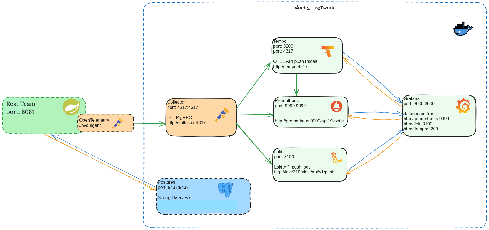
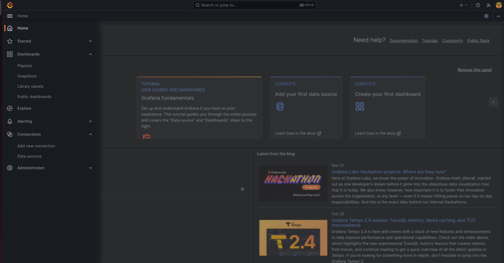
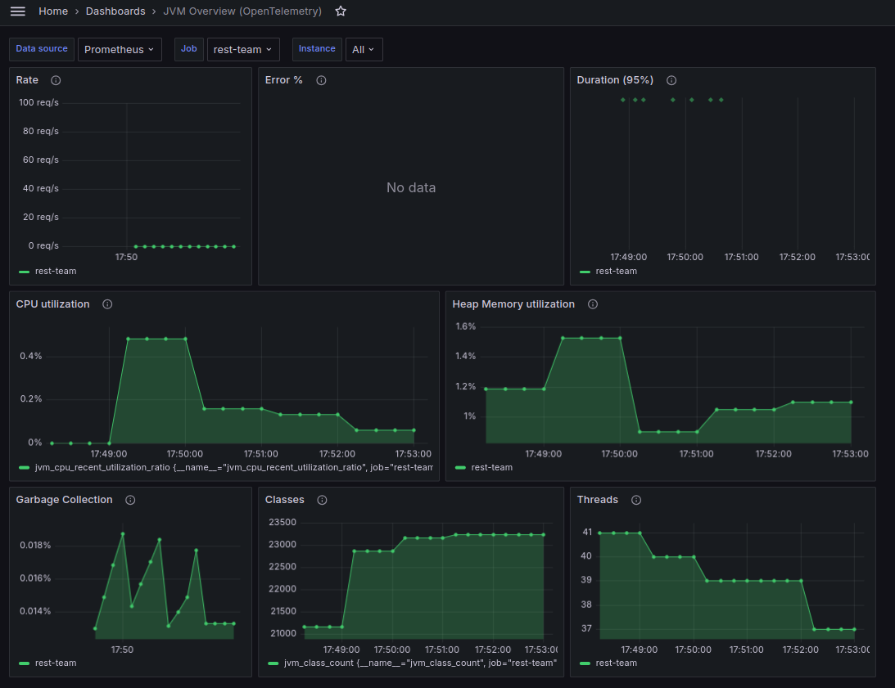
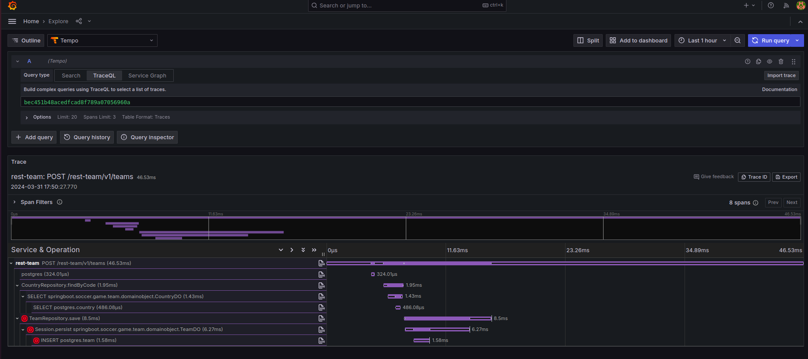
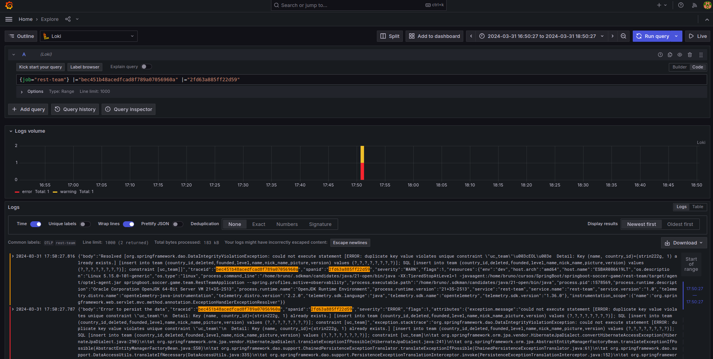
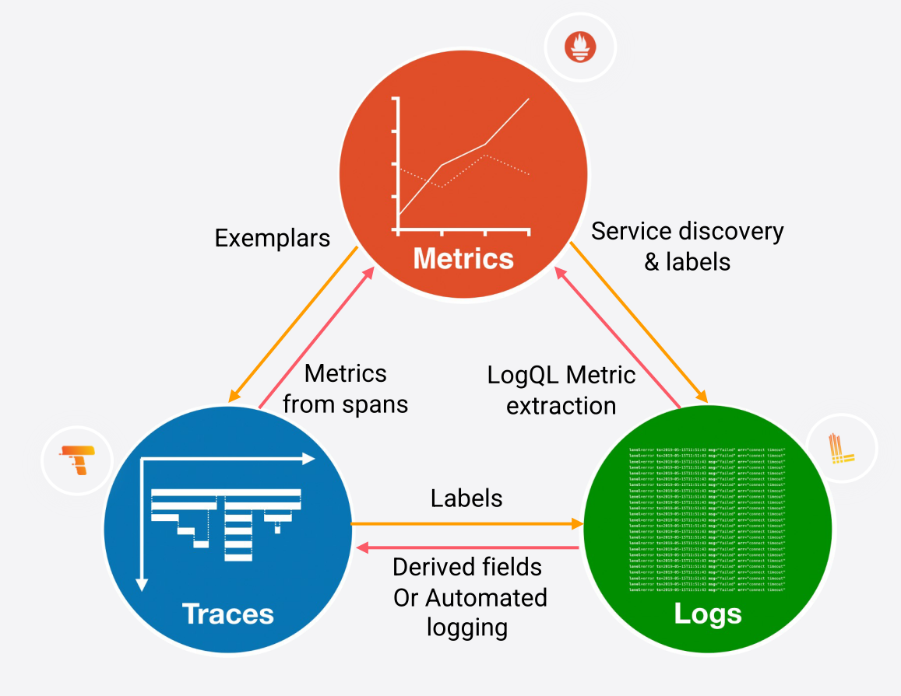
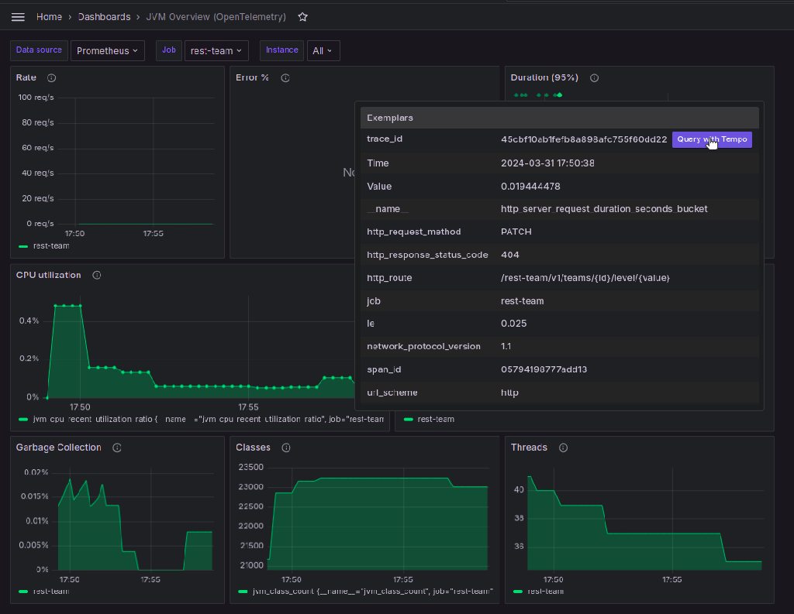
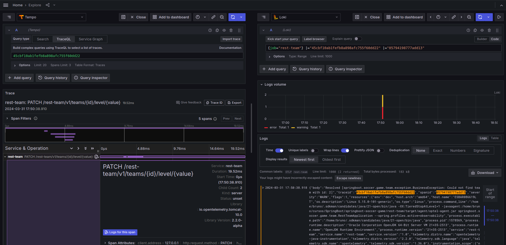

# rest-team project

This project uses Spring Boot, makes it easy to create stand-alone, production-grade Spring based Applications that you can "just run".

This API allows CRUD operations on a soccer team.

## Running the application
### Approach 1 - Using Docker Compose at Development Time

With this approach you need to have docker and docker-compose installed in your local computer. This is the command
that you have to run:

```shell script
mvn spring-boot:run
```

This command will start the containers below and the rest-team application will connect with the first two containers:
-  Postgres
-  Keycloak

### Approach 1.1 - Using Docker Compose with Observability at Development Time 

With this approach you need to have docker and docker-compose installed in your local computer. This is the command
that you have to run:

```shell script
mvn spring-boot:run -Pobservability
```

This command will start the containers below and the rest-team application will connect with the first three containers:
-  Postgres
-  Keycloak
-  Opentelemetry Collector
-  Prometheus
-  Grafana Loki
-  Grafana Tempo
-  Grafana

### Approach 2 - Using Test Containers at Development Time

With this approach you need to have only docker installed in your local computer. This is the command that you have to run:

```shell script
mvn spring-boot:test-run
```

This command will start the containers below and the rest-team application will connect with both containers:
-  Postgres
-  Keycloak

### Approach 3 - Building a Container Image with Buildpacks and use Docker Compose to run the application and dependents containers

With this approach you need to have docker and docker-compose installed in your local computer.

There is no `Dockerfile` in this project (it is using buildpacks to build the container image).

You can build a container image for the rest-team project (if you have a docker daemon) using the Spring Boot build plugin:

```bash
mvn spring-boot:build-image
```

After that you will run the application and the others containers using docker-compose.

This is the command that you have to run:
```bash
docker-compose -f ../infrastructure/docker-compose-linux.yaml --profile rest-team up
```

This command will start the containers below:
-  Rest-team 
-  Postgres
-  Keycloak

### Approach 3.1 - Building a Container Image with Buildpacks and use Docker Compose with Observability to run the application and dependents containers

With this approach you need to have docker and docker-compose installed in your local computer.

There is no `Dockerfile` in this project (it is using buildpacks to build the container image).

You can build a container image for the rest-team project (if you have a docker daemon) using the Spring Boot build plugin:

```bash
mvn spring-boot:build-image -Pobservability
```

After that you will run the application and the others containers using docker-compose.

This is the command that you have to run:
```bash
docker-compose -f ../infrastructure/docker-compose-linux.yaml --profile rest-team-observability up
```

This command will start the containers below:
-  Rest-team-observability
-  Postgres
-  Keycloak
-  Opentelemetry Collector
-  Prometheus
-  Grafana Loki
-  Grafana Tempo
-  Grafana


### Approach 4 - Building a Lightweight Container with Cloud Native Buildpacks and use Docker Compose to run the application and dependents containers

With this approach you need to have docker and docker-compose installed in your local computer and to build the Native Image 
you will need to have installed the OpenJDK from GraalVM 21 (for instance: GraalVM CE 21.0.2+13.1). 
To install the openJDK the easiest way is through SDKMan.

There is no `Dockerfile` in this project (it is using buildpacks to build the Native image).

You can build a Native image for the rest-team project (if you have a docker daemon) using the Spring Boot build plugin:

```bash
mvn -Pnative spring-boot:build-image
```

After that you will run the application and the others containers using docker-compose.

This is the command that you have to run:
```bash
docker-compose -f ../infrastructure/docker-compose-linux.yaml --profile rest-team up
```

This command will start the containers below:
-  Rest-team
-  Postgres
-  Keycloak

---

## Overall Comments

### Final Solution

Once executing the final solution and accessing the swagger
[page](http://127.0.0.1:8081/rest-team/swagger-ui/index.html?configUrl=/rest-team/v3/api-docs/swagger-config#/), you can see the
concern in respecting Restful endpoints (as well as the Http Status
codes).

**Swagger - How to call the endpoints via swagger-ui**
- For the Soccer team application endpoints
    - You have to set the Authorization header for the applications endpoints that have the **LOCKER** signal, to generate the Authorization header you have put the username and password values inside the **"Authorize"** field in the right side of the page.

      - To generate the access token for the Authorization header for the user **teamuser** that belong to the **"team"** role from Keycloak server, you have fill the fields "username" and "password" with the value "teamuser" inside of the section "Keycloak (OAuth2, password)"

      - To generate the access token for the Authorization header for the user **test** that does not belong to the **"team"** role from Keycloak server, you have fill the fields "username" and "password" with the value "test" inside of the section "Keycloak (OAuth2, password)"


 

### Keycloak

This is the url to access the [Keycloak console](http://127.0.0.1:8080/auth/) configuration.
The username and password are "admin"

---

## Observability

To deploy all the observability stack (OpentTelemetry collector, Prometheus, Loki, Tempo and Grafana) along with the application, follow the approaches 1.1 or 3.1 above.

### Obervability stack diagram


### Visualization
For visualization, we are using Grafana, an open-source observability platform that centralizes and visualizes metrics, traces, and logs.\
Grafana home page: http://localhost:3000/ \
User: admin \
Password: admin



### Metrics
For metric monitoring, we are employing Prometheus, a free and open-source application designed for event monitoring and alerting.\
Prometheus records metrics in a time series database using an HTTP pull model, enabling flexible queries and real-time alerting. \

*Path*: *Home > Dashboards > JVM Overview (OpenTelemetry)*



### Traces
For traces, we're using Grafana Tempo, an open-source, user-friendly, and scalable distributed tracing backend.\
Tempo operates efficiently, utilizing only object storage, and integrates seamlessly with Grafana, Prometheus, and Loki. \

Path: *Home > Datasources > Tempo > Explore*



### Logs

For logs, we're leveraging Loki, a horizontally scalable, highly available, multi-tenant log aggregation system inspired by Prometheus. \
Loki is designed to be cost-effective and easy to operate, relying on indexing the labels for each log stream rather than the contents of the logs. \

Path: *Home > Datasources > Loki > Explore*




### Coordinate Observability: Navigation between observability pilars
In Grafana, we can navigate from metrics to traces and from traces to logs.




#### From metrics to traces




#### From traces to logs



---

## Testing

The test strategy adopted was based on the test pyramid where in the base
we have more Unit and towards the top, we have the integrations and
UI/functional.

A caveat to be mentioned specially when it comes to the Integration
Tests: as they were pretty complex and to speed up the integration tests execution,
the test containers are created before the execution of the test methods in the Integration Test Class and they are
destroyed after the execution of them.

The coverage is pretty good and you can take a look at the Jacoco plugin
reports available in the IDE/command line.


### Testing With Native Build Tools

GraalVM Native Build Tools includes the ability to run tests inside a native image.
This can be helpful when you want to deeply test that the internals of your application work in a GraalVM native image.

To test the Native Image you will need to have installed the OpenJDK from GraalVM 21 (for instance: GraalVM CE 21.0.2+13.1).
To install the openJDK the easiest way is through SDKMan.

To build the image and run the tests, use the test goal with the nativeTest profile active:

```shell script
mvn -PnativeTest clean test
```

---

## Static Analyzing (SonarQube)

Running Sonar as Docker container
```shell script
sudo sysctl -w vm.max_map_count=524288
sudo sysctl -w fs.file-max=131072
ulimit -n 131072
ulimit -u 8192
docker-compose -f ../infrastructure/sonarqube-docker-compose.yaml up
```
This is the url to access the [SonarQube](http://127.0.0.1:9000/projects?sort=-analysis_date).
The username and password are "admin"

In the first access of the [SonarQube](http://127.0.0.1:9000/projects?sort=-analysis_date), you have to change the password, so please 
change the password to "adminadmin".

In case you have a Sonar instance running locally (or a Docker
Container), you can execute the command:
```shell script
mvn clean install -Psonar
```
In order to observe the potential Bugs, Code smells,
Technical Debt, etc. The results will be similar to this one:


